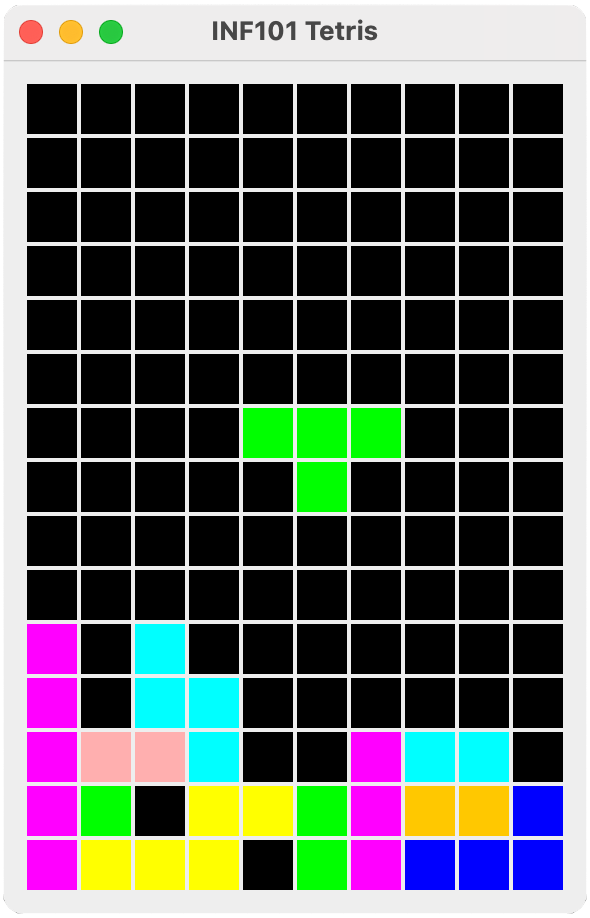

# Tetris

I denne oppgaven skal vi implementere Tetris. Dersom du ikke har spilt Tetris før, anbefaler vi å prøve. Det kan spilles gratis på *The Tetris Company* sin offisielle hjemmeside [tetris.com/play-tetris](https://tetris.com/play-tetris/).

I denne oppgaven skal du følge en steg-for-steg -guide for å lage et enkelt Tetris-spill fra grunnen av og opp ved hjelp av Swing-rammeverket som er inkludert i Java sitt standard-bibliotek. Selv om det kanskje finnes andre og bedre måter å lage Tetris på, anbefaler vi på det aller sterkeste at du følger denne guiden så nøyaktig som mulig. Det gjør det lettere for oss å hjelpe deg dersom du blir sittende fast.

## Oversikt over arkitektur

Vi vil her først gi et fugleperspektiv av koden vi skal opprette; i guiden som er linket til nedenfor vil opprettelsen av disse klassene gjøres i mer detalj.

Vi baserer modellen vår på design-prinsippet om [model-view-controller](https://en.wikipedia.org/wiki/Model%E2%80%93view%E2%80%93controller), hvor vi i størst mulig grad ønsker å skille fra hverandre
 - selve logikken og datastrukturene i modellen,
 - hvordan modellene *vises*, og
 - hvordan modellen *kontrolleres* av brukeren.

I denne guiden deler vi sågar inn koden vår i tre hovedpakker: 
 - *inf101.tetris.model*
 - *inf101.tetris.view*
 - *inf101.tetris.controller*

I tillegg vil vi benytte oss av en datastruktur for rutenett som er mer generell, og som skal være i pakken
 - *inf101.grid*

Det hele kjøres fra `TetrisMain` i pakken *inf101.tetris*, som inneholder main-metoden. Foreløpig viser den bare en enkel gui med noen eksempeler på tilfeldige figurer, men når vi er ferdig starter vi Tetris fra main-metoden her.

### Modell

For å representere et spill med Tetris, er det to hoved-elementer vi må holde styr på:
 - et *brett* med fliser, og
 - en *fallende brikke*.

Vi identifiserer følgende klasser som egner seg for pakken *inf101.tetris.model*:
 - `TetrisModel` en klasse som representerer tilstanden til et komplett spill med Tetris. Denne klassen vil ha feltvariabler som representerer brettet med fliser og den fallende brikken, samt informasjon om spillet er game over.
 - `TetrisBoard` en klasse som representerer et brett med fliser. Dette er i bunn og grunn et rutenett.
 - `Tetromino` er en klasse som representerer en tetris-brikke.

 Modellen er på mange måter den viktigste delen av koden, og vi ønsker at koden som ligger i modellen er godt testet.

 ### Visning

 For å vise modellen grafisk, lar vi det det være en klasse `TetrisView` i pakken *inf101.tetris.view* som har som ansvar å tegne Tetris-modellen. For å tegne Tetris, er planen at TetrisView
  - først tegner Tetris-brettet, og
  - deretter tegner den fallende brikken "over" brettet.

TetrisView trenger å ha tilgang til modellen for å kunne tegne den, men vi ønsker at vi ikke skal uforvarende kunne *endre* modellen når vi gjør ting i TetrisView. For å innkapsle modellen vår, lar vi `ViewableTetrisModel` være et grensesnitt i pakken *inf101.tetris.view* som beskriver hvilke metoder TetrisView behøver for å tegne et Tetris-brett. Så lar vi modellen TetrisModel implementere dette grensesnittet. TetrisView vil altså aldri vite at den (egentlig) jobber med en TetrisModel, den vet bare at den er en ViewableTetrisModel.

### Kontroll

I pakken *inf101.tetris.controller* lar vi det være en klasse `TetrisController` som har som sitt ansvarsområde å endre modellen basert på input fra brukeren, samt styre ting som skjer av seg selv (slik som at brikken faller ned et hakk med jevne mellomrom).

På samme måte som for visningen, er kontrolleren avhengig av tilgang til modellen. Samtidig vil vi innkapsle modellen så mye som mulig. Vi lar det derfor være et grensesnitt `ControllableTetrisModel` i pakken *inf101.tetris.controller* som beskriver hvilke metoder kontrolleren trenger tilgang til, og så lar vi modellen vår TetrisModel implementere dette grensesnittet.

 ## Copyright

 Tetris er et spill hvor The Tetris Company har alle rettigheter. Du kan derfor *ikke* publisere din versjon av Tetris offentlig når du er ferdig; ditt Tetris-spill er kun for deg selv og dine aller nærmeste, og vi gjenskaper det kun i undervisningsøyemed. Forøvrig ligger det en severdig dokumentar om hvordan Nintendo kuppet rettighetene til Tetris  foran snuten på Atari på [Gaming Historian](https://www.youtube.com/watch?v=_fQtxKmgJC8) sin YouTube-kanal.

