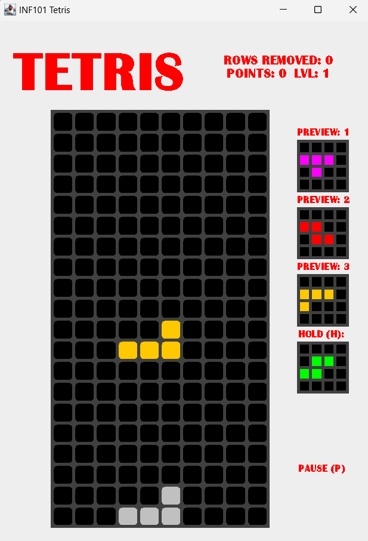

### Tetris Game Implementation
This repository contains a Java-based implementation of the classic Tetris game. The project was developed as part of a course assignment and demonstrates the use of object-oriented programming principles and the Model-View-Controller (MVC) design pattern. This implementation was recognized as one of the Top 5 projects by the course teaching team.

### How to Play:
To run the game, execute TetrisMain.java.
Use the arrow keys to move and rotate the falling Tetrominoes.

## Copyright:
The Tetris game mechanics and intellectual property is owned by The Tetris Company and is a trademarked product. 
This project is for educational purposes only and is not affiliated with or endorsed by The Tetris Company. Please do not distribute or use this project for commercial purposes.
This project was developed as part of an academic assignment for the INF101 course at UiB.
